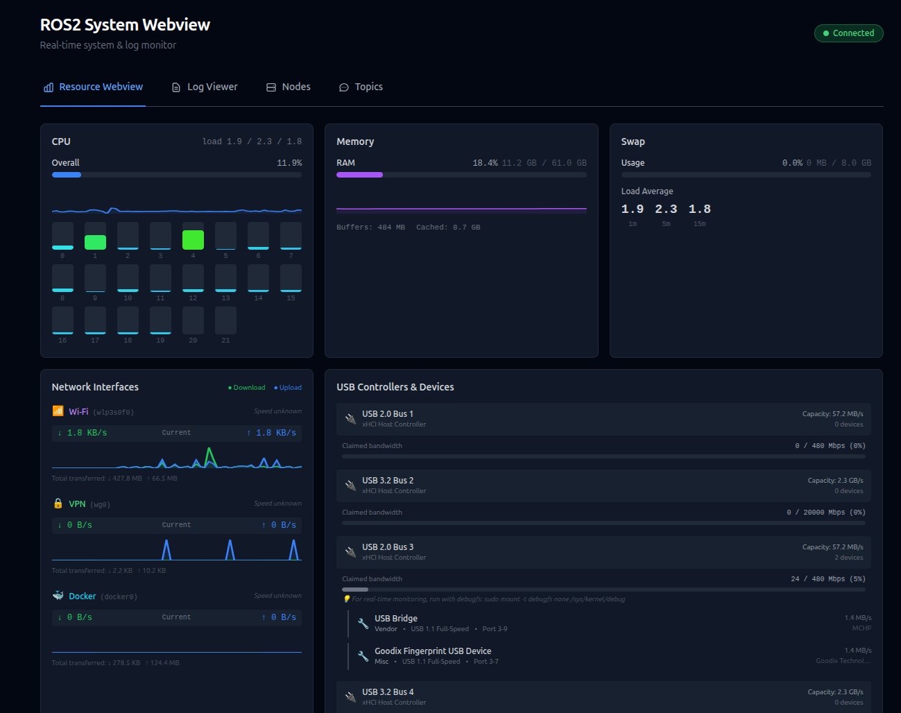
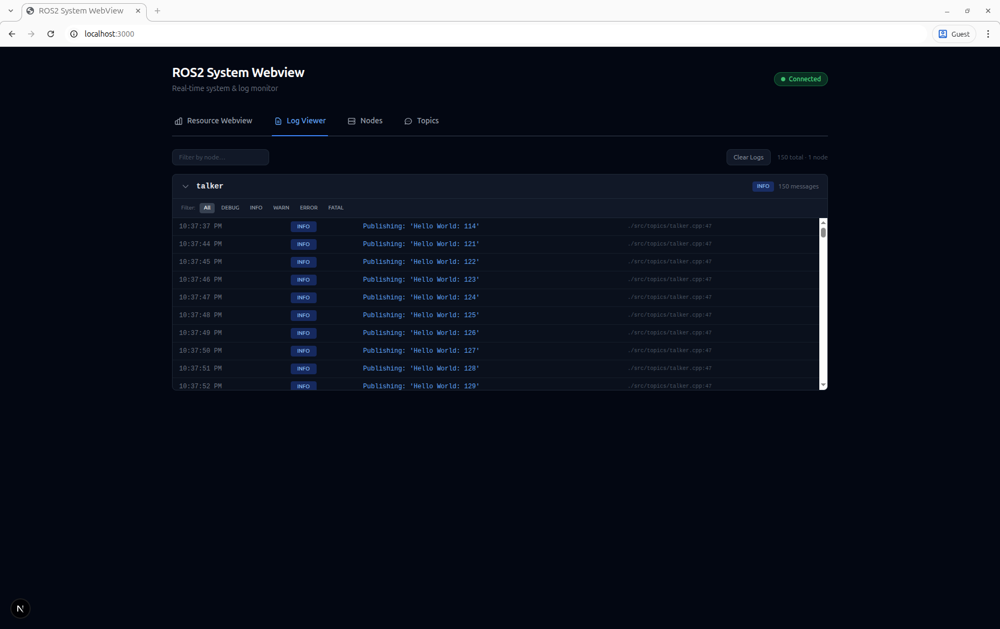
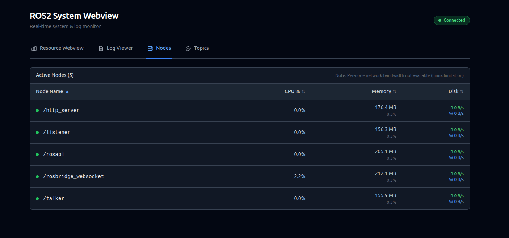
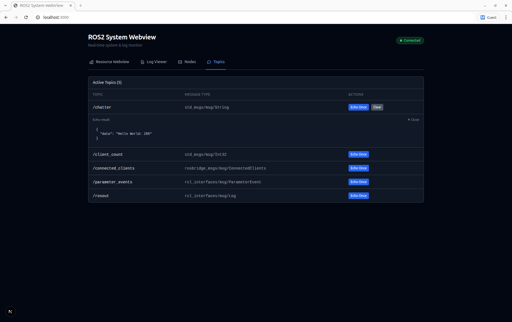
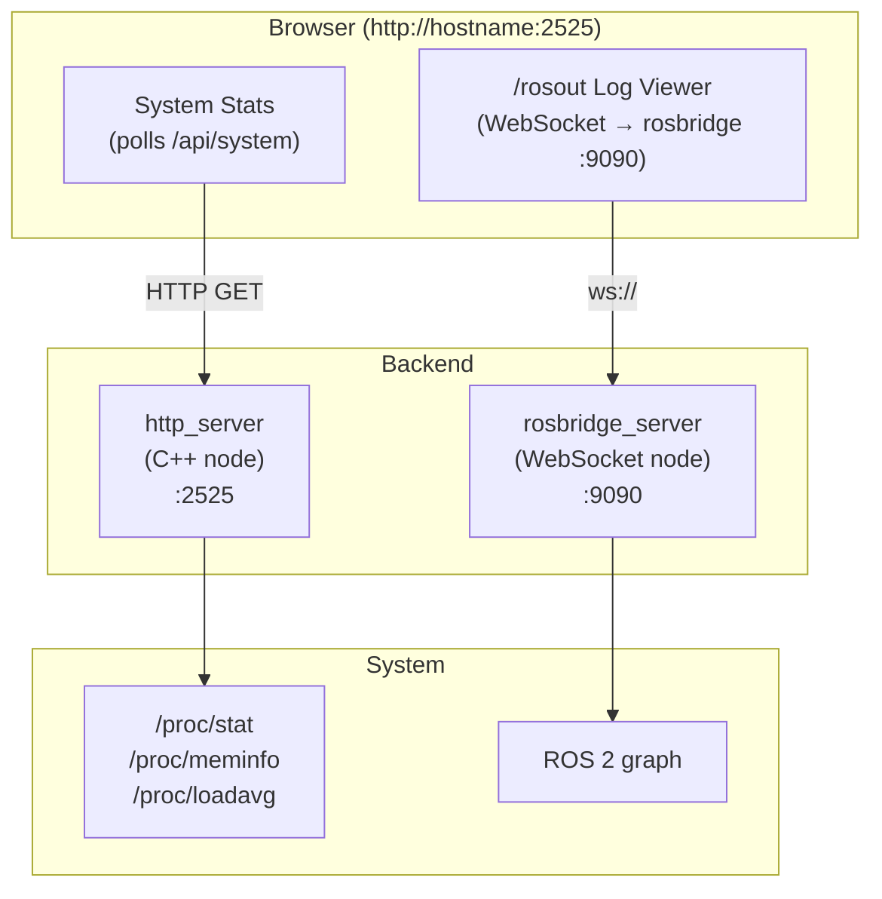

# system_webview

A real-time system monitoring dashboard for ROS 2. It provides a web-based UI that displays live CPU, memory, network bandwidth, USB bus utilization, and load average statistics, a scrollable `/rosout` log viewer, and interactive node and topic browsers — all served from a single ROS 2 node.


## Features

### Resource Monitor



### Log Viewer



### Node Viewer



### Topic Viewer



## Enabling Real-Time USB Monitoring

By default, the dashboard shows _claimed_ USB bandwidth based on device speeds. For **actual** real-time USB traffic monitoring (useful for detecting camera saturation), enable usbmon:

```bash
# Load the usbmon kernel module
sudo modprobe usbmon

# Mount debugfs (skip if already mounted)
mountpoint -q /sys/kernel/debug || sudo mount -t debugfs none /sys/kernel/debug

# Verify usbmon is available
sudo ls /sys/kernel/debug/usb/usbmon/
```

When usbmon is available and the process has read access, USB bus cards will show a "📊 Live" badge with actual bandwidth usage. Without it, only claimed bandwidth is displayed.

> **Note:** The http_server process needs read access to `/sys/kernel/debug/usb/usbmon/0u`. Run with sudo or adjust permissions as needed.

## Architecture



## Prerequisites

- **ROS 2** (Humble, Iron, or Jazzy)
- **colcon** build tool
- **Node.js ≥ 18** and **npm** (used at build time to compile the frontend)
- **cpp-httplib** development headers

### Install system dependencies (Ubuntu)

```bash
sudo apt update
sudo apt install ros-${ROS_DISTRO}-rosbridge-server libcpp-httplib-dev nodejs npm
```

> **Note:** If your distro's Node.js is too old, use [nvm](https://github.com/nvm-sh/nvm) to install a recent version.

## Building

Clone into a colcon workspace and build:

```bash
mkdir -p ~/ros2_ws/src
cd ~/ros2_ws/src
git clone https://github.com/namo-robotics/ros2_system_webview.git

cd ~/ros2_ws
source /opt/ros/${ROS_DISTRO}/setup.bash
colcon build
source install/setup.bash
```

The build automatically runs `npm install && npm run build` inside the `web/` directory and installs the static export to `share/system_webview/web`.

## Usage

### Launch

The included launch file starts two nodes: **rosbridge_websocket** and the **http_server**:

```bash
ros2 launch system_webview main.launch.py
```

Then open **<http://localhost:2525>** in a browser.

#### Changing the HTTP port

```bash
ros2 launch system_webview main.launch.py http_port:=8080
```

> **Note:** The rosbridge WebSocket port is hard-coded to `9090` because the web frontend expects this port.

### Building the Web-App

The compiled webapp files are committed directly into the repo so that the ros2 package can be built without
dependencies on npm or javascript packages.

To compile the web app and build the full ros2 package, run:

```bash
./build.sh
```

### Development mode

A helper script runs the Next.js dev server (with hot-reload on port 3000), the C++ HTTP server (API on port 2525), and rosbridge side-by-side:

```bash
# Build once first
colcon build --packages-select system_webview
source install/setup.bash

./dev.sh
# → Web UI:    http://localhost:3000  (hot-reload)
# → Stats API: http://localhost:2525/api/system
# → rosbridge: ws://localhost:9090
```

## Dependencies

| Package              | Purpose                             |
| -------------------- | ----------------------------------- |
| `rclcpp`             | ROS 2 C++ client library            |
| `rosbridge_server`   | WebSocket bridge for the browser    |
| `libcpp-httplib-dev` | Header-only C++ HTTP server library |

## License

This project is licensed under the MIT License — see the [LICENSE](LICENSE) file for details.
